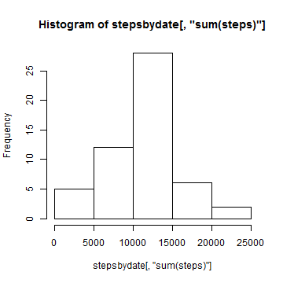

PEER ASSESSMENT 1 REPRODUCIBLE RESEARCH
========================================================

I will first set echo to TRUE so I won't have to do it each time I create a chunk in r. 


```r
opts_chunk$set(echo = TRUE)
```


Libraries to call:


```r
library(sqldf)
```

```
## Loading required package: gsubfn
## Loading required package: proto
## Loading required package: RSQLite
## Loading required package: DBI
## Loading required package: RSQLite.extfuns
```

```r
library(lattice)
```

### Loading and Preprocessing the data

I will get the data online, on a zip file. I create a temp file to save the zip, and then unzip it and read it into 'pa1'. Show first 5 rows of pa1 to check. Set field steps to numeric.


```r
setInternet2(TRUE)
temp <- tempfile()
download.file("https://github.com/andresborrerom/RepData_PeerAssessment1/raw/master/activity.zip", 
    temp)
pa1 <- read.csv(unz(temp, "activity.csv"))
pa1$steps <- as.numeric(pa1$steps)
head(pa1, 5)
```

```
##   steps       date interval
## 1    NA 2012-10-01        0
## 2    NA 2012-10-01        5
## 3    NA 2012-10-01       10
## 4    NA 2012-10-01       15
## 5    NA 2012-10-01       20
```

```r
unlink(temp)
```


### What is mean total number of steps taken per day?

1. Histogram total steps.   
Using SQLDF I will sum steps by unique dates, and then plot a histogram.


```r
stepsbydate <- sqldf("select date, sum(steps) from pa1 group by date", drv = "SQLite")
```

```
## Loading required package: tcltk
```

```r
stepsbydate[, "sum(steps)"] <- as.numeric(stepsbydate[, "sum(steps)"])
hist(stepsbydate[, "sum(steps)"], 7)
```

 


2. Calculate mean and median


```r
promedio <- mean(stepsbydate[, "sum(steps)"], na.rm = TRUE)
mediana <- median(stepsbydate[, "sum(steps)"], na.rm = TRUE)
```


The mean is 1.0766 &times; 10<sup>4</sup>. 
The median is 1.0765 &times; 10<sup>4</sup>. 


### What is the average daily activity pattern?

I create a matrix with interval in column 1 and the steps averaged by date in column 2. Then I plot it with x-axis the interval.


```r
meaninterval <- sqldf("select interval, avg(steps) from pa1 group by interval", 
    drv = "SQLite")
plot(meaninterval)
```

 


```r
m <- subset(meaninterval, meaninterval[, 2] == max(meaninterval[, 2]))
```


The interval with the maximum steps average is 835


### Imputing missing values


```r
p <- subset(pa1, is.na(pa1$steps))
```


1. Total number of rows with NAs: 2304

My strategy for imputting missing values is to group the steps by interval and day of the week (1 through 7). I will imput the mean of these groups into the missing values. 

First I will create the new column weekday (values 1:7): 


```r
num_day <- matrix(rep(0, nrow(pa1)), nrow(pa1), 1)
num_day <- data.frame(num_day)
pa1_w <- cbind(pa1, num_day)
day = 0
for (i in 1:nrow(pa1)) {
    if (pa1_w$interval[i] == 0) {
        if (day < 7) 
            day = day + 1 else day = 1
    }
    pa1_w$num_day[i] <- day
}
pa1_w[2000:2020, ]
```

```
##      steps       date interval num_day
## 2000     0 2012-10-07     2235       7
## 2001     0 2012-10-07     2240       7
## 2002     0 2012-10-07     2245       7
## 2003     0 2012-10-07     2250       7
## 2004     0 2012-10-07     2255       7
## 2005     0 2012-10-07     2300       7
## 2006     0 2012-10-07     2305       7
## 2007     0 2012-10-07     2310       7
## 2008     0 2012-10-07     2315       7
## 2009     0 2012-10-07     2320       7
## 2010     0 2012-10-07     2325       7
## 2011     0 2012-10-07     2330       7
## 2012     0 2012-10-07     2335       7
## 2013     0 2012-10-07     2340       7
## 2014     0 2012-10-07     2345       7
## 2015     0 2012-10-07     2350       7
## 2016     0 2012-10-07     2355       7
## 2017    NA 2012-10-08        0       1
## 2018    NA 2012-10-08        5       1
## 2019    NA 2012-10-08       10       1
## 2020    NA 2012-10-08       15       1
```


Now,  I will replace the NAs with the mean of the same interval and weekday, ignoring NAs. Then I will imput the values where missing. 


```r
avg_wd_int <- sqldf("select interval, num_day, avg(steps) from pa1_w group by interval,num_day", 
    drv = "SQLite")

head(avg_wd_int, 10)
```

```
##    interval num_day avg(steps)
## 1         0       1      1.429
## 2         0       2      0.000
## 3         0       3      4.250
## 4         0       4      5.875
## 5         0       5      0.000
## 6         0       6      0.000
## 7         0       7      0.000
## 8         5       1      0.000
## 9         5       2      0.000
## 10        5       3      2.250
```

```r
for (i in 1:nrow(pa1_w)) {
    if (is.na(pa1_w$steps[i])) {
        temporal <- subset(avg_wd_int, avg_wd_int$num_day == pa1_w$num_day[i] & 
            avg_wd_int$interval == pa1_w$interval[i])
        pa1_w$steps[i] <- temporal[, "avg(steps)"]
    }
}

head(pa1_w, 5)
```

```
##   steps       date interval num_day
## 1 1.429 2012-10-01        0       1
## 2 0.000 2012-10-01        5       1
## 3 0.000 2012-10-01       10       1
## 4 0.000 2012-10-01       15       1
## 5 0.000 2012-10-01       20       1
```


(Above: New data set with missing values filled in (head)).

Calculate total steps per day:

```r
stepsbydate2 <- sqldf("select date, sum(steps) from pa1_w group by date", drv = "SQLite")
stepsbydate2[, "sum(steps)"] <- as.numeric(stepsbydate2[, "sum(steps)"])
hist(stepsbydate2[, "sum(steps)"], 7)
```

 


2. Calculate mean and median


```r
promedio2 <- mean(stepsbydate2[, "sum(steps)"], na.rm = FALSE)
mediana2 <- median(stepsbydate2[, "sum(steps)"], na.rm = FALSE)
```


The mean of the new with filled in data is 1.0821 &times; 10<sup>4</sup>. 
The median of the new with filled in data is 1.1015 &times; 10<sup>4</sup>. 
 
Taking this new calculated data, we have aproximately **55** more steps in average per day, and a greater median by **250** steps.

### Are there differences in activity patterns between weekdays and weekends?

I can use my new column created numday to be the division weekday or weekend. Because 2012-10-01 was Monday, and I have it as numday = 1,   weekends will be where numday = 6 or 7. 


```r
for (i in 1:nrow(pa1_w)) {
    if (pa1_w$num_day[i] == 6 | pa1_w$num_day[i] == 7) 
        pa1_w$num_day[i] = "weekend" else pa1_w$num_day[i] = "weekday"
}

pa1_w[1438:1445, ]
```

```
##      steps       date interval num_day
## 1438     0 2012-10-05     2345 weekday
## 1439     0 2012-10-05     2350 weekday
## 1440     0 2012-10-05     2355 weekday
## 1441     0 2012-10-06        0 weekend
## 1442     0 2012-10-06        5 weekend
## 1443     0 2012-10-06       10 weekend
## 1444     0 2012-10-06       15 weekend
## 1445     0 2012-10-06       20 weekend
```


Now, create with SQL commands, a data frame with the average number of steps taken per interval when weekday and when weekend.


```r
avg_int_wd_we <- sqldf("select num_day, interval, avg(steps) from pa1_w group by interval, num_day", 
    drv = "SQLite")


head(avg_int_wd_we, 5)
```

```
##   num_day interval avg(steps)
## 1 weekday        0      2.311
## 2 weekend        0      0.000
## 3 weekday        5      0.450
## 4 weekend        5      0.000
## 5 weekday       10      0.175
```

```r

head(avg_int_wd_we[, 2], 5)
```

```
## [1]  0  0  5  5 10
```

```r
xyplot(avg_int_wd_we[, 3] ~ avg_int_wd_we[, 2] | avg_int_wd_we[, 1], xlab = "Interval", 
    ylab = "Number of Steps")
```

 


## The End
